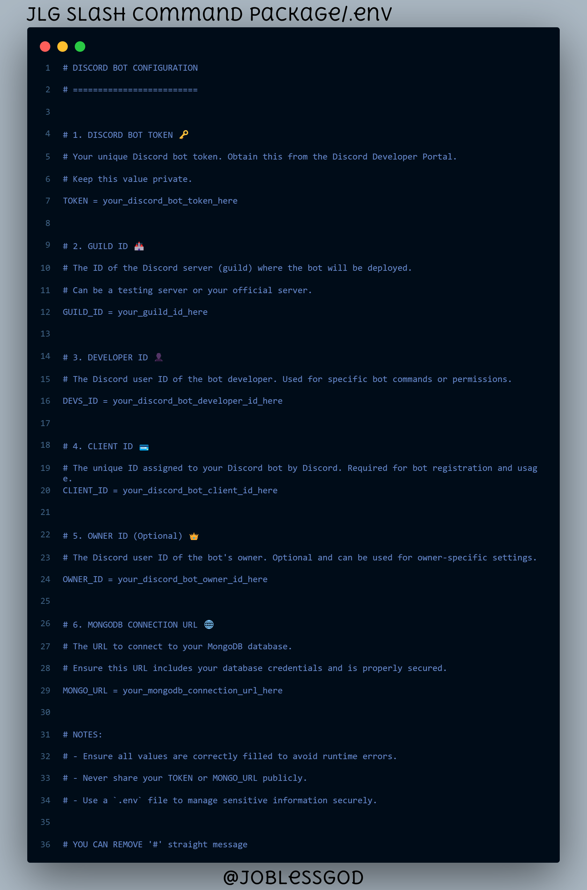
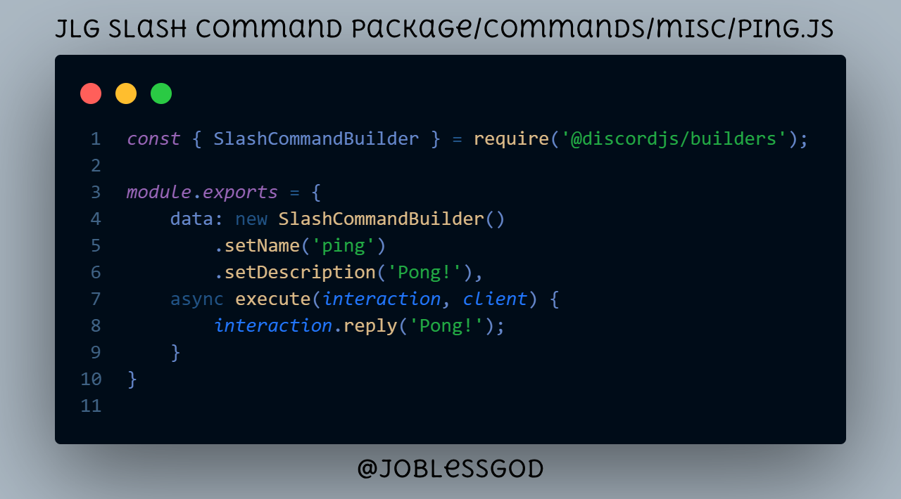
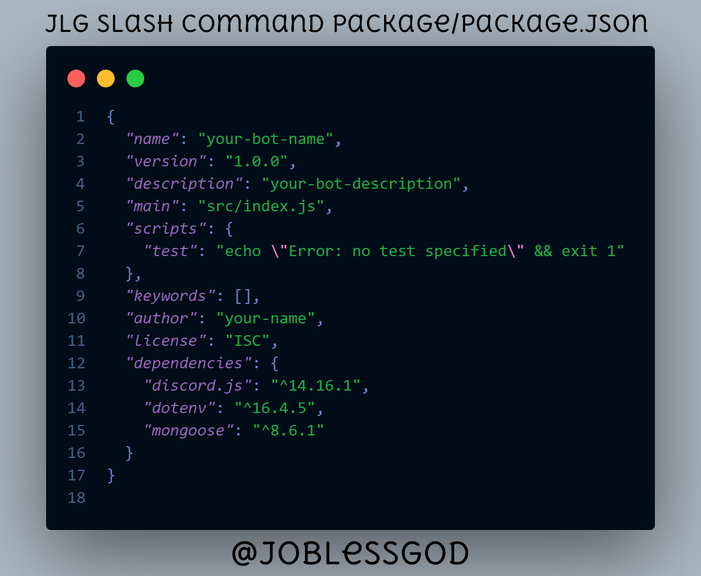

# JLG Slash Command Package

Welcome to the **JLG Slash Command Package**! This package is designed to simplify the creation and management of slash commands for your applications. Whether you're building a bot or a server-side application, this package provides a streamlined solution to handle commands efficiently.


## Features

- **Easy Setup**: Get started quickly with our pre-configured setup.
- **Customizable Commands**: Easily create and modify slash commands to fit your needs.
- **Example Commands**: Includes example commands to help you get started.

## Getting Started

To use the JLG Slash Command Package, follow these steps:

1. **Clone the Repository**

   ```bash
   git clone https://github.com/joblessgod/jlg-slash-command-package.git
   cd jlg-slash-command-package
   ```

2. **Install Dependencies**

   Make sure you have [Node.js](https://nodejs.org/) installed. Then run:

   ```bash
   npm install
   ```

3. **Configuration**

   Copy the example environment configuration file and update it with your credentials.

   ```bash
   cp .env.example .env
   ```

   

4. **Run the Application**

   To start the application, use:

   ```bash
   npm start
   ```

   The server should now be running, and you can start adding your slash commands.

## Commands

Here’s an example of a basic slash command included in this package:



The `ping` command can be triggered to get a response from the server. You can modify or add new commands in the `commands` directory.

## Configuration File

The `package.json` file is set up with all the necessary dependencies and scripts. You can view the configuration file here:



## Contributing

We welcome contributions to improve the JLG Slash Command Package. If you have suggestions or bug reports, please open an issue on [GitHub](https://github.com/joblessgod/jlg-slash-command-package/issues). Pull requests are also welcome!

## License

This project is licensed under the [MIT License](LICENSE).

## Contact

For any questions or support, please contact us at [Discord](https://discord.gg/CxCssZH4xk ).
